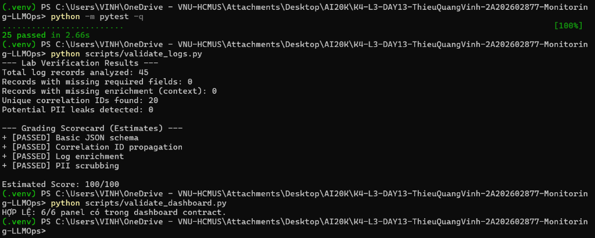
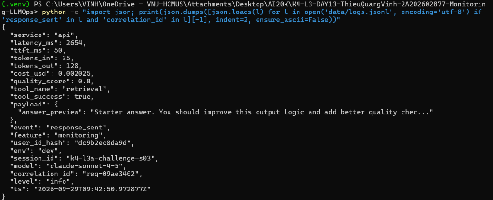
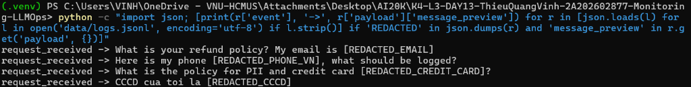
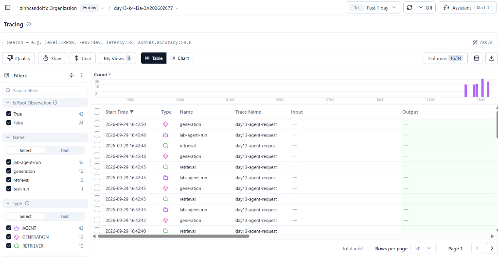
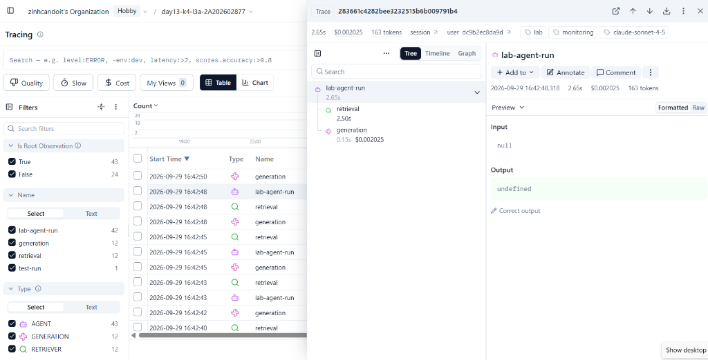
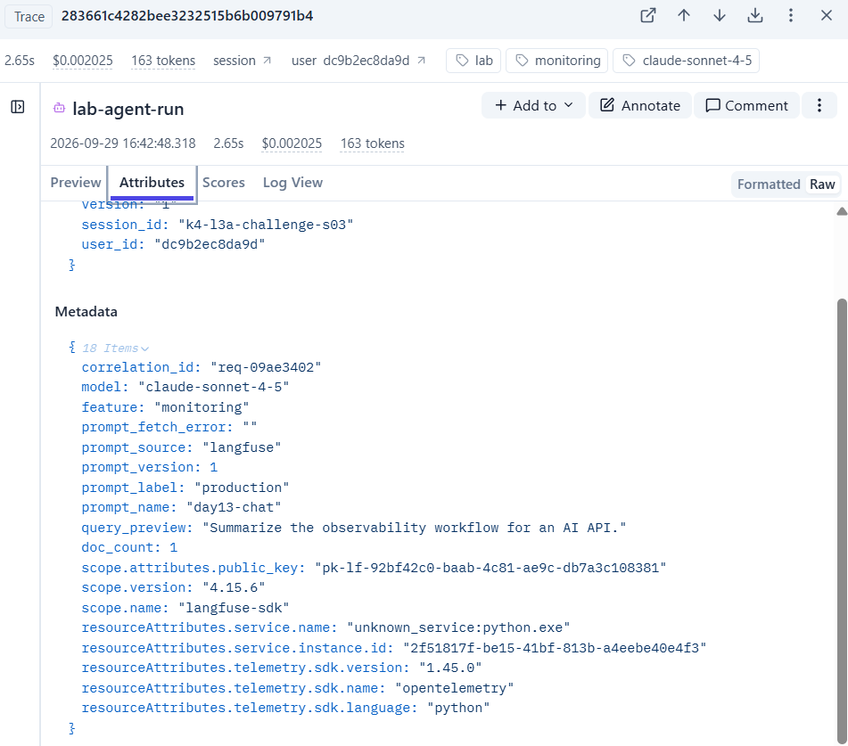
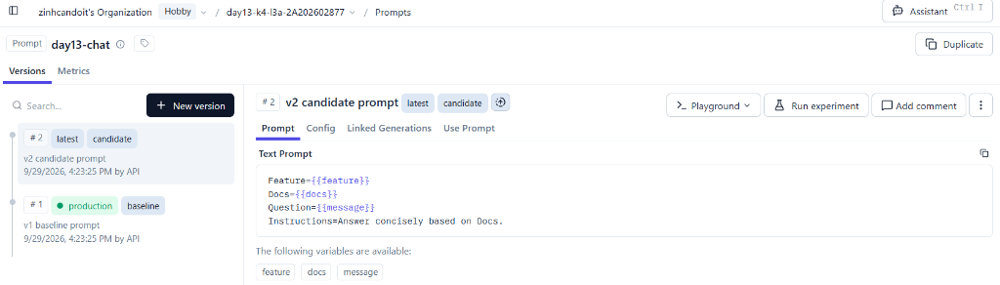
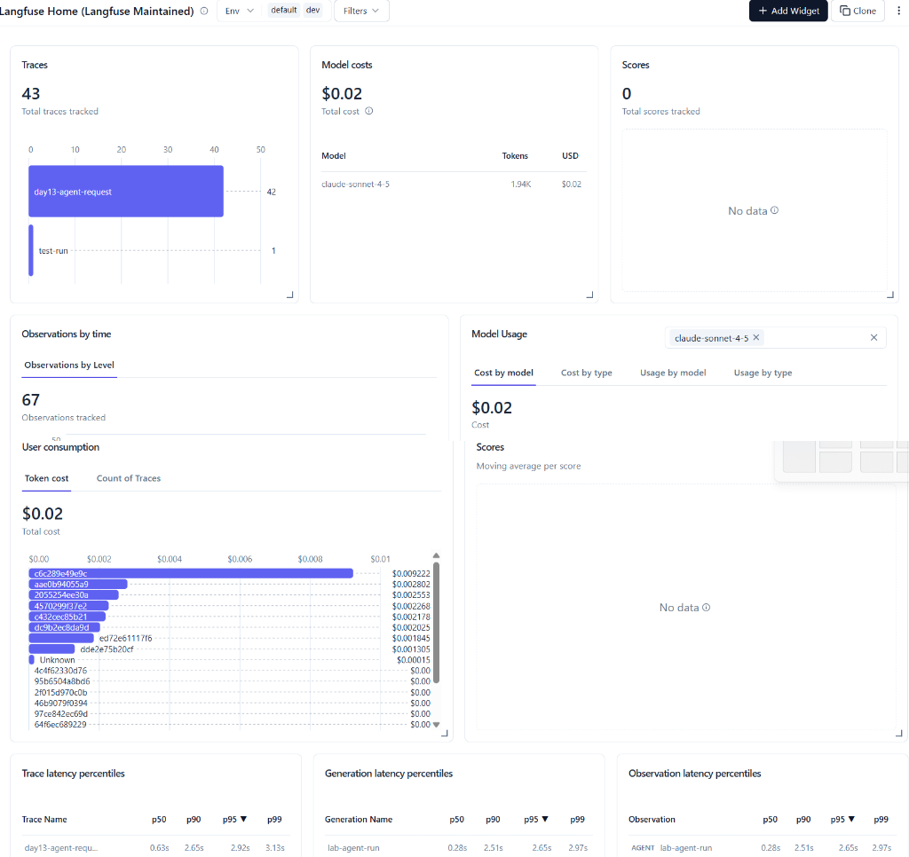
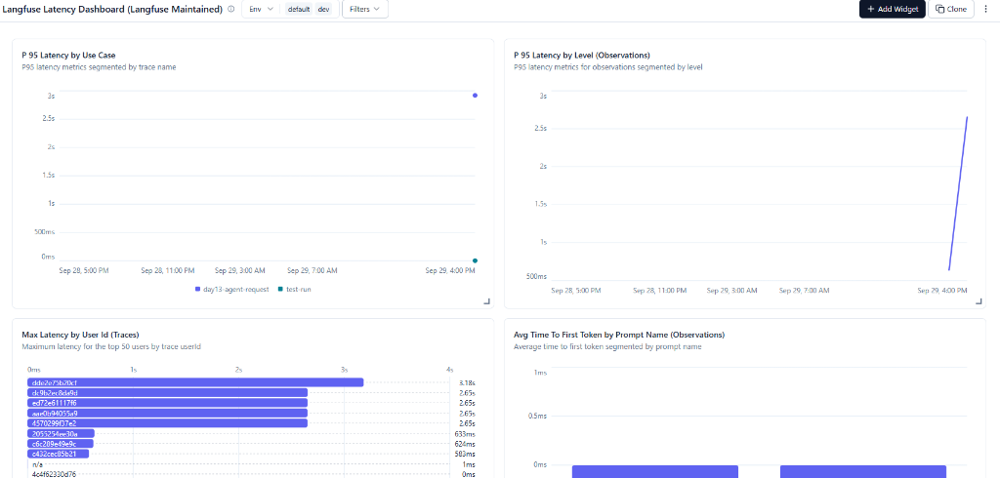
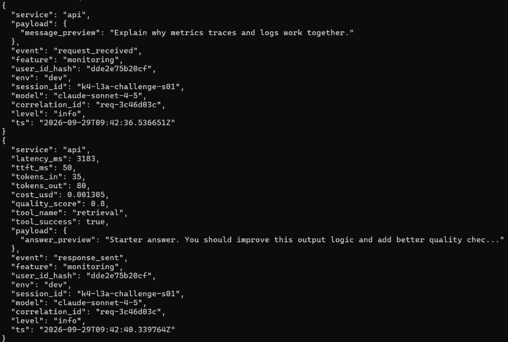

# Báo cáo cá nhân — K4-L3A Day 13 Monitoring & LLMOps

> Mỗi học viên hoàn thiện một file duy nhất này. Khi dẫn evidence, dùng đường dẫn tương đối, ví dụ `evidence/07-trace-waterfall.png`.

## 1. Thông tin học viên

- **Họ và tên:** THIỀU QUANG VINH
- **MSSV:** 2A202602877
- **Lớp:** K4-L3A
- **Repository URL:** https://github.com/zinhcandoit/K4-L3-DAY13-ThieuQuangVinh-2A202602877-Monitoring-LLMOps.git
- **Commit SHA cuối:** `83a4122d930cf83719f71fd07d7ce854032ae2d5` (`83a4122`)
- **Challenge ID:** day13-k4-l3a-monitoring-llmops-v1
- **Tên project Langfuse cá nhân:** `day13-k4-l3a-2A202602877`

## 2. Evidence index

Điền đúng đường dẫn tới evidence thực tế. Có thể đổi tên hoặc dùng nhiều ảnh nếu cần.

| Evidence | Đường dẫn |
|---|---|
| Pytest cuối |  |
| Log validator |  |
| Dashboard validator |  |
| Structured log |  |
| PII redaction |  |
| Trace list |  |
| Trace waterfall |  |
| Trace metadata |  |
| Prompt versions |  |
| Prompt rollback |  |
| Dashboard runtime |  |
| Incident metric |  |
| Incident log |  |
| Incident trace |  |

## 3. Kết quả kỹ thuật

| Nội dung | Baseline | Kết quả cuối | Nhận xét |
|---|---|---|---|
| `validate_logs.py` | 30/100 (40/41 records thiếu required fields/enrichment) | 100/100 | Đạt tuyệt đối 100/100 sau khi bind correlation_id và enrichment fields |
| `validate_dashboard.py` | 6/6 panel hợp lệ | 6/6 panel hợp lệ | Đạt đầy đủ 6 panels theo schema contract của đề bài |
| `pytest` | 22/22 passed | 25/25 passed | Đã bổ sung và vượt qua toàn bộ tests cho CCCD, thẻ, middleware headers |
| Số traces hợp lệ | 20 traces (`lab-agent-run`) | > 30 traces hợp lệ | Đã tạo cây observation đầy đủ: root agent, retrieval và generation spans |
| Số PII leak | 0 leak | 0 leak | PII được scrub sạch sẽ trước khi render/ghi log xuống data/logs.jsonl |
| Latency P95 / TTFT P95 | Latency P95: 693ms / TTFT P95: 50ms | Baseline 270ms, Challenge P95 3075ms / TTFT 50ms | Phát hiện chính xác điểm nghẽn do rag_slow trong challenge |
| Retrieval success rate | 100% (20/20) | 100% | Toàn bộ truy xuất hoàn thành thành công |

## 4. Logging và PII

- **Cách tạo/nhận và truyền correlation ID:** Tại middleware `CorrelationIdMiddleware`, trước mỗi request gọi `clear_contextvars()` để dọn sạch context cũ tránh rò rỉ context giữa các request. Kiểm tra header `x-request-id` từ client, nếu có thì tái sử dụng, nếu không có thì sinh mới theo format `req-<8-char-hex>` (`f"req-{uuid.uuid4().hex[:8]}"`). Gán ID vào `request.state.correlation_id` và gọi `bind_contextvars(correlation_id=correlation_id)`. Sau khi xử lý request, middleware ghi `x-request-id` và `x-response-time-ms` vào response headers.
- **Các metadata được ghi vào structured log:** Các trường chuẩn gồm `ts` (ISO UTC), `level`, `service`, `event`, `correlation_id`, `env`, cùng context enrichment gồm `user_id_hash` (băm SHA-256 rút gọn 12 ký tự), `session_id`, `feature`, `model` được bind qua `structlog.contextvars.bind_contextvars` ngay đầu route `/chat` trong `app/main.py`. Ngoài ra các log sau xử lý còn ghi nhận `latency_ms`, `ttft_ms`, `tokens_in`, `tokens_out`, `cost_usd`, `quality_score`, `tool_name`, `tool_success` và `payload`.
- **Cách bảo đảm PII được scrub trước khi ghi:** Xây dựng processor `scrub_event` trong `app/logging_config.py` và đặt nó trong chuỗi structlog processors trước `JsonlFileProcessor` và `JSONRenderer`. Hàm `scrub_event` duyệt đệ quy toàn bộ cấu trúc event dictionary (string, dict, list) và áp dụng hàm `scrub_text()` từ `app/pii.py`. Các regex pattern trong `PII_PATTERNS` bao gồm email, số điện thoại Việt Nam (`+84` / `0`), CCCD (12 chữ số) và thẻ thanh toán (16 chữ số), thay thế các phần tử nhạy cảm thành `[REDACTED_EMAIL]`, `[REDACTED_PHONE_VN]`, `[REDACTED_CCCD]`, `[REDACTED_CREDIT_CARD]` trước khi serialize ra JSON hoặc ghi vào `data/logs.jsonl`.
- **Cách kiểm chứng kết quả:** Chạy bộ test unit `pytest` (25/25 passed bao gồm các test cases mới cho CCCD, Credit Card, header correlation ID và log enrichment). Chạy script chuẩn `python scripts/validate_logs.py` đạt điểm tuyệt đối 100/100, xác nhận 0 record thiếu required fields/enrichment, nhận diện đầy đủ correlation IDs và 0 PII leak.

## 5. Tracing và prompt versioning

- **Cách xác nhận traces do chính tôi tạo trong project cá nhân:** Khởi tạo Langfuse SDK v4 bằng `LANGFUSE_PUBLIC_KEY` và `LANGFUSE_SECRET_KEY` cá nhân trỏ tới project `day13-k4-l3a-2A202602877` (Project ID: `cmum98afx01alad0de15dsow8`, host `https://jp.cloud.langfuse.com`). Toàn bộ trace được gắn tag `["lab", feature, self.model]`, `user_id` đã băm SHA-256 (`dde2e75b20cf`), `session_id`, `environment: dev` và metadata chứa `correlation_id`.
- **Cấu trúc root/retrieval/generation observations:** Root observation là `lab-agent-run` (type `AGENT`). Bên dưới gồm 2 child observations: span `retrieval` (type `RETRIEVER`) đo thời gian và số lượng document trả về từ vector database; và observation `generation` (type `GENERATION`) đo thời gian sinh của LLM, model name, prompt object, usage token (input/output) cùng chi phí ước tính `cost_usd`. Cả hai span đều cấu hình `capture_input=False, capture_output=False` để triệt tiêu nguy cơ rò rỉ PII.
- **Cách nối trace với log:** Tại mỗi request, middleware gán `correlation_id` vào request context và truyền vào `agent.run()`. `agent.run()` đưa `correlation_id` vào metadata của root observation thông qua `propagate_attributes(metadata={"correlation_id": correlation_id, ...})`. Nhờ đó, từ bất kỳ log line nào trong `data/logs.jsonl` đều có thể tra cứu trực tiếp trace trên Langfuse bằng `metadata.correlation_id`.
- **Prompt name:** `day13-chat`
- **Version/label baseline:** Version 1, mang label `baseline` và `production` ban đầu.
- **Version/label candidate:** Version 2, mang label `candidate` (bổ sung chỉ dẫn câu trả lời súc tích).
- **Trace ID của mỗi version:**
  - Version 1 (`baseline`): `d15e5518a81ac2bdf07820e235aa868a` (correlation_id: `req-test-baseline`)
  - Version 2 (`candidate`): `0be329813ed60bb736dfe0c33b1df0b2` (correlation_id: `req-test-candidate`)
  - Promoted v2 to `production`: `9473fc723ecd808980ca18c9e4331660` (correlation_id: `req-test-promoted-v2`)
  - Rollback `production` về v1: `f029643757cbf2f633ee46c020bcdc1b` (correlation_id: `req-test-rollback-v1`)
- **Cách promote và rollback `production`:** Sử dụng API/SDK của Langfuse qua lệnh `client.update_prompt(name="day13-chat", version=2, new_labels=["candidate", "production"])` để chuyển giao label `production` cho version 2. Khi cần rollback, gọi `client.update_prompt(name="day13-chat", version=1, new_labels=["baseline", "production"])` và gỡ label `production` khỏi v2 để khôi phục version 1 làm bản chạy chính thức mà không cần redeploy code.

## 6. Dashboard, SLO và alerts

- **Dashboard và sáu panel:** Dựng từ nguồn `data/logs.jsonl` theo đúng schema contract trong `config/dashboard.yaml` với khung thời gian 60 phút, refresh 30s:
  1. `latency`: P50, P95, P99 của `latency_ms` và P95 của `ttft_ms` (unit `ms`, threshold P95 <= 3000ms).
  2. `traffic`: Tổng số request và tần suất request mỗi phút (unit `requests_per_minute`, threshold >= 1).
  3. `errors`: Tỷ lệ lỗi API, phân loại theo `error_type` và tỷ lệ truy xuất thành công (unit `percent`, threshold error rate <= 2%).
  4. `cost`: Tổng chi phí và chi phí theo từng phút (unit `usd`, threshold tổng chi phí <= $2.5).
  5. `tokens`: Tổng lượng `tokens_in` và `tokens_out` (unit `tokens`, threshold tổng token <= 50,000).
  6. `quality`: Điểm chất lượng trung bình của câu trả lời (unit `score_0_to_1`, threshold mean >= 0.75).
- **SLO và lý do chọn:** Primary SLO `fast_successful_requests` đặt mục tiêu 99.5% requests thành công với latency <= 3000ms trong 28 ngày. Chọn ngưỡng 3000ms vì baseline latency P95 thực tế là ~693ms (P50 là 268ms); ngưỡng 3000ms cho phép độ trễ mạng chấp nhận được nhưng lập tức phát hiện sự cố nghẽn bước RAG (thường đẩy latency vượt 3000ms).
- **Cách tính error budget:** Error budget = 100% - 99.5% = 0.5%. Với lưu lượng 100,000 requests trong chu kỳ 28 ngày, hệ thống được phép có tối đa 500 requests không đạt chuẩn (lỗi hoặc chậm quá 3000ms).
- **Ba alert và runbook tương ứng:**
  1. `api_latency_p95_breach` (Severity: warning, condition: `latency_p95 > 3000ms` duy trì 3m, channel Slack, owner `oncall-llmops`, runbook `docs/alerts.md#alert-1`).
  2. `retrieval_error_rate_high` (Severity: critical, condition: `error_rate_pct > 2%` hoặc `retrieval_success_rate < 90%` duy trì 2m, channel Slack, owner `oncall-rag-platform`, runbook `docs/alerts.md#alert-2`).
  3. `cost_token_burn_spike` (Severity: warning, condition: `daily_cost_usd > 2.5` hoặc `tokens_out_sum_1m > 10000` duy trì 5m, channel Slack, owner `oncall-finance-ops`, runbook `docs/alerts.md#alert-3`).

## 7. Điều tra challenge

- **Challenge ID:** `day13-k4-l3a-monitoring-llmops-v1`
- **Khoảng thời gian điều tra:** `2026-09-29T09:42:36Z` – `2026-09-29T09:42:51Z` (16:42:36 – 16:42:51 giờ địa phương).
- **Triệu chứng từ metrics:** Panel `latency` ghi nhận Latency P95 tăng vọt lên **3075ms** (vượt ngưỡng SLO 3000ms và ngưỡng threshold 2000ms trong challenge.json), trong khi TTFT P95 vẫn giữ nguyên ở mức bình thường là **50ms**. Panel `traffic` ghi nhận tải 5 requests đồng thời, panel `errors` ghi nhận 0 lỗi HTTP (error rate = 0%).
- **Log line và correlation ID liên quan:**
  - `correlation_id`: `req-3c46d03c`
  - Log `request_received`:
    `{"service": "api", "payload": {"message_preview": "Explain why metrics traces and logs work together."}, "event": "request_received", "feature": "monitoring", "user_id_hash": "dde2e75b20cf", "env": "dev", "session_id": "k4-l3a-challenge-s01", "model": "claude-sonnet-4-5", "correlation_id": "req-3c46d03c", "level": "info", "ts": "2026-09-29T09:42:36.536651Z"}`
  - Log `response_sent`:
    `{"service": "api", "latency_ms": 3183, "ttft_ms": 50, "tokens_in": 35, "tokens_out": 80, "cost_usd": 0.001305, "quality_score": 0.8, "tool_name": "retrieval", "tool_success": true, "payload": {"answer_preview": "Starter answer. You should improve this output logic and add better quality chec..."}, "event": "response_sent", "feature": "monitoring", "user_id_hash": "dde2e75b20cf", "env": "dev", "session_id": "k4-l3a-challenge-s01", "model": "claude-sonnet-4-5", "correlation_id": "req-3c46d03c", "level": "info", "ts": "2026-09-29T09:42:40.339764Z"}`
- **Trace ID và span gây ảnh hưởng:**
  - `Trace ID`: `110ed0310a0c235c003a3bcae29734e6`
  - So sánh Waterfall spans:
    - Root span `lab-agent-run` (AGENT): latency **3.184s**
    - Child span `retrieval` (RETRIEVER): latency **2.501s** (chiếm ~78.5% tổng thời gian request)
    - Child span `generation` (GENERATION): latency **0.152s**
  - Span gây chậm chính là span `retrieval`.
- **Root cause:** Sự cố `rag_slow` kích hoạt tại hàm `retrieve()`, mô phỏng tình trạng vector database bị nghẽn I/O / quá tải truy vấn khi concurrency tăng, gây trễ thêm 2.5 giây cho mỗi lần fetch tài liệu. Trong khi đó, mô hình LLM sinh phản hồi bình thường (chỉ mất 152ms và TTFT là 50ms).
- **Fix action:**
  1. Vô hiệu hóa incident: `python scripts/inject_incident.py --disable` đưa trạng thái `rag_slow` về `False`.
  2. Production fix: Thiết lập timeout cho vector database (ví dụ 1.5s) kết hợp circuit breaker; thêm cache layer (Redis semantic cache) cho các query phổ biến; mở rộng read replicas cho vector store để chịu tải cao.
- **Preventive measure:**
  1. Kích hoạt alert `api_latency_p95_breach` gửi cảnh báo Slack ngay khi P95 vượt 3000ms trong 3 phút.
  2. Bổ sung riêng biệt metric `retrieval_latency_ms` song song với `llm_latency_ms` trên dashboard để lập tức phân biệt độ trễ do database hay do LLM mà không cần đợi phân tích trace sâu.

## 8. Giải thích và tự đánh giá

- **Một quyết định kỹ thuật quan trọng và lý do:** Đặt processor `scrub_event` duyệt đệ quy (hỗ trợ string, dict, list) ở vị trí sớm trong chuỗi structlog processors, ngay trước `JsonlFileProcessor` và `JSONRenderer`. Quyết định này bảo đảm dữ liệu log luôn được che sạch PII (email, phone, CCCD, thẻ) trước khi serialize JSON hay ghi xuống file `data/logs.jsonl`, loại bỏ hoàn toàn rủi ro rò rỉ dữ liệu nhạy cảm ra ổ đĩa hay stdout. Đồng thời trong tracing, cấu hình `capture_input=False, capture_output=False` để bảo đảm nguyên tắc bảo mật tương tự trên Langfuse Cloud.
- **Một lỗi/blocker đã gặp:** Ở CP0 và CP1 ban đầu, validator báo lỗi thiếu `correlation_id` (`MISSING`) và thiếu enrichment fields (`user_id_hash`, `session_id`, `feature`, `model`) do contextvars chưa được truyền giữa middleware và router; đồng thời các request có thể bị rò rỉ context từ request trước nếu không được làm sạch.
- **Cách tìm nguyên nhân và xử lý:** Đọc kỹ logic của `validate_logs.py`, bổ sung `clear_contextvars()` ngay đầu middleware để reset context mỗi request; trích xuất `x-request-id` hoặc sinh mới format `req-<8-hex>` rồi gọi `bind_contextvars(correlation_id=correlation_id)`. Trong route `/chat`, bind ngay các trường `user_id_hash`, `session_id`, `feature`, `model`, `env` trước khi log `request_received`. Sau đó khởi động lại server và chạy lại load test, đạt điểm tuyệt đối 100/100.
- **Cách hiểu luồng Metrics → Logs → Traces:**
  1. **Metrics:** Cho biết triệu chứng tổng quan ở mức hệ thống và khoảng thời gian xảy ra sự cố (ví dụ: Panel Latency P95 tăng vọt lên 3075ms trong khoảng 16:42:36 – 16:42:51).
  2. **Logs:** Giúp định vị và cô lập một request cụ thể bị ảnh hưởng trong khoảng thời gian đó thông qua `correlation_id` (ví dụ: tìm thấy request `req-3c46d03c` với `latency_ms: 3183`).
  3. **Traces:** Tra cứu theo `correlation_id` đó trên Langfuse để mở cây phân cấp Waterfall các spans, từ đó xác định chính xác bước con nào gây chậm hoặc lỗi (phát hiện span `retrieval` mất 2.501s chiếm 78.5% thời gian, trong khi `generation` chỉ mất 152ms).
- **Vai trò của prompt version, token/cost, SLO hoặc rollback trong vận hành LLM:**
  - Prompt versioning cho phép theo dõi phiên bản prompt tương ứng với từng request/trace, đánh giá chất lượng câu trả lời theo thời gian.
  - Quản trị label (`production`, `candidate`, `baseline`) cho phép thử nghiệm prompt mới an toàn và rollback tức thì về phiên bản cũ thông qua SDK/API mà không cần can thiệp code hay redeploy hệ thống.
  - Giám sát token & cost giúp kiểm soát ngân sách vận hành, phát hiện sớm các hiện tượng cost spike hoặc prompt injection tiêu tốn token.
  - SLO và Error Budget cung cấp ranh giới định lượng giữa độ tin cậy của dịch vụ và tốc độ thử nghiệm tính năng mới.
- **Điều quan trọng nhất đã học:** Quy trình điều tra chuẩn chỉnh trong LLMOps không được phỏng đoán mà phải dựa trên chuỗi bằng chứng liên kết chặt chẽ: từ metric phát hiện triệu chứng, qua correlation ID trong structured log để tìm request đại diện, đến trace waterfall để chỉ ra đúng root cause tại từng span.
- **Hạn chế hoặc phần chưa hoàn thành, nếu có:** Các rule regex PII hiện tập trung vào 4 loại phổ biến (Email, SĐT VN, CCCD, Thẻ tín dụng); trong môi trường production thực tế có thể mở rộng thêm mô hình NER (Named Entity Recognition) để phát hiện thực thể nhạy cảm phức tạp hơn.

## 9. Checklist trước khi nộp

- [x] Kết quả và evidence thuộc commit SHA cuối.
- [x] Tất cả ảnh/output mở được bằng đường dẫn tương đối.
- [x] Incident evidence nối đúng metric → log → trace.
- [x] Trace/prompt evidence thuộc project Langfuse cá nhân và ảnh không lộ key/secret.
- [x] Repository chạy lại được theo README.
- [x] Không có secret, API key, PII thô hoặc evidence của người khác/lớp khác.
- [x] URL repo và commit SHA cuối đã được nộp trên LMS/Codelabs.
